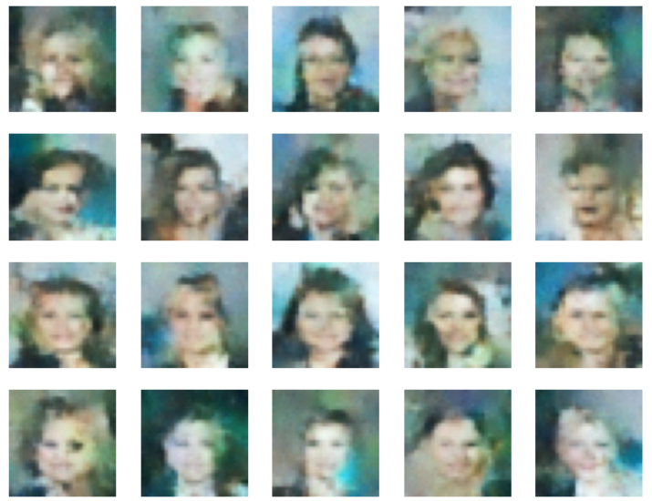

# Understanding and Implementing Diffusion Models for Image Generation on CelebA
This is a project done for the class Mathematics for ML and DL for my second year of master on Data Science for Scocial Sciences at the Toulouse School of Economics.

## Overview
This project explores diffusion models, a class of generative models, and their application in image generation, specifically using the CelebA dataset. The primary focus is on understanding U-Net architectures and their role in diffusion models.

## Objectives
1.  Understanding U-Net and Diffusion Models
2.  Dataset Preparation
3.  Implementing Diffusion Models
4.  Generating Images with Diffusion Models
5.  Documentation

## Resources and References
- [U-Net Paper](https://arxiv.org/abs/1505.04597)
- [Tutorial on Diffusion Model](https://github.com/d9w/gen_models/blob/main/Score_Based_Generative_Modeling.ipynb)
- [Score-Based Generative Modeling through Stochastic Differential Equations](https://arxiv.org/abs/2011.13456)
- [Denoising Diffusion Probabilistic Models](https://arxiv.org/abs/2006.11239)
- Blog posts on diffusion models: [Post 1](https://yang-song.net/blog/2021/score/), [Post 2](https://lilianweng.github.io/posts/2021-07-11-diffusion-models/)
- CelebA dataset: Deep Learning Face Attributes in the Wild by Ziwei Liu, Ping Luo, Xiaogang Wang, and Xiaoou Tang [CelebA Dataset](https://mmlab.ie.cuhk.edu.hk/projects/CelebA.html)

## 1. Understanding U-Net and Diffusion Models

### U-Net Architectures
The U-Net architecture, introduced by Ronneberger et al. (2015), is a convolutional neural network model designed for image segmentation. It consists of a contracting path (encoder) and an expansive path (decoder), with connecting paths and a bottleneck. The encoder extracts information, while the decoder reconstructs the input. The connecting paths concatenate features between encoder and decoder.

### Diffusion Models
Diffusion models generate new data based on the data they are trained on. They involve forward diffusion (adding noise) and backward diffusion (reversing the process). The forward process transforms the data distribution to a well-behaved distribution, while the backward process reconstructs the original data. Diffusion models use techniques like Score-Based Generative Models (SGMs) and Stochastic Differential Equations.

## 2. Dataset Preparation

### CelebA Dataset
The CelebA dataset comprises 202,599 face images of over 10,000 celebrities with rich annotations. The dataset is diverse, making it suitable for training diffusion models. Preprocessing involves resizing, converting to tensors, and normalizing images.

## 3. Implementing Diffusion Models

### U-Net Architecture
A U-Net architecture is implemented with contracting and expansive paths. Connecting paths concatenate features, and a bottleneck connects encoder and decoder.

### Diffusion Model
A diffusion model is implemented with forward diffusion steps, where noise is added gradually, and a U-Net is used in the process. The model is trained using Mean Squared Error loss and Adam optimizer.

## 4. Generating Images with Diffusion Models

The implemented diffusion model is applied to generate images from CelebA.

## 5. Documentation

### README.md
This document provides an overview of the project, outlines objectives, details dataset preparation, diffusion model implementation, and image generation. References and resources are included.

### REPORT.md
A detailed report on U-Net architectures and diffusion models, including mbasic athematical and practical aspects in image generation.

## 6. Analysis and Results

The diffusion model, while not achieving optimal performance due to resource constraints, demonstrates the capability to generate facial images. The generated images exhibit noise but show potential for improvement with further training and resource allocation. Challenges encountered include limited resources impacting model complexity and training duration.

Here are the final generated images:

## Expected Deliverables
1. Codebase with U-Net and Diffusion Model implementation.
2. Generated images from CelebA dataset.
3. README.md summarizing the project.
4. REPORT.md providing a detailed report on U-Net and diffusion models.
