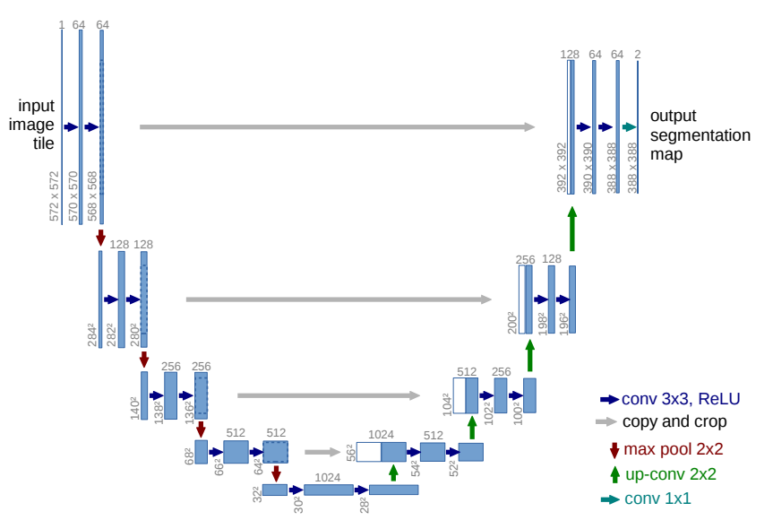

This is a brief report that provides an in-depth explanation of U-Net architectures and diffusion models, including their mathematical and practical aspects in image generation.

# U-Net Architectures and Diffusion Models

## U-Net Architectures

U-Net is a type of convolutional neural network (CNN) that was developed for biomedical image segmentation and introduced by Ronnerberger et al. (2015). It is particularly useful for image segmentations, hip resolution, and diffusion models. It's called U-net because of the U-shape shape of its architecture. The architecture of U-Net is symmetric and consists of two paths: a contracting path (encoder) and an expansive path (decoder). In the original paper, the architecture is presented as follows:

### Contracting Path

The contracting path, also known as encoder, is the "descending" part of the architechture. During this phase, the model extracts information about what is present in the image, to the detriment of spatial and contextual information. It follows the typical architecture of a convolutional network. It consists of repeated application of two 3x3 convolutions (unpadded), each followed by a rectified linear unit (ReLU) and a 2x2 max pooling operation with stride 2 for downsampling. At each downsampling step, the number of feature channels is doubled.

Mathematically, the operation at each layer $i$ in the contracting path can be represented as:

$$ H_i = \text{ReLU}(\text{Conv}(H_{i-1})) $$

where $H_i$ is the feature map at layer $i$, and $\text{Conv}$ denotes the convolution operation.

### Expansive Path

The expansive path, also known as decode, is the "ascending" part after the contraction point of the model. The objective is to reconstruct the input using the information extracted during the contracting path. Every step in the expansive path consists of an upsampling of the feature map followed by a 2x2 convolution ("up-convolution"), a concatenation with the correspondingly feature map from the contracting path, and two 3x3 convolutions, each followed by a ReLU.

Mathematically, The operation at each layer $i$ in the expansive path can be represented as:

$$ H_i = \text{ReLU}(\text{Conv}(\text{Concatenate}(H_{i-1}, H'_{i-1}))) $$

where $H'_{i-1}$ is the corresponding feature map from the contracting path.

### Other Elements

Besides the encoder and decoder, thera are two other elements that are important in the U-net architecture: the bottlenet and the connecting paths.

The Connecting paths take a copy of the features from the symmetrical part of the encoder and concatenate them onto their opposing stage in the decoder.

The bottleneck is where the encoder switches into the decoder. First, we downsample the features with a 2x2 max pooling operation. Then we pass them through the repeated 3x3 convolutional layers followed by a ReLU activation function and we double the channels. Finally, we upsample them again to their previous resolution.

Here there is a simplified U-Net drawing that I made to make the distinction between this four element clearer:

## Diffusion Models

Diffusion models, also known as Denoising Diffusion Probabilistic Models (DDPMs), are a class of generative models that gradually denoise data starting from pure noise. They transform noise from a simple distribution into a data sample.

The initial paper on Diffusion Models is “Deep Unsupervised Learning using Nonequilibrium Thermodynamics” written by Sohl-Dickstein et al. in 2015. As described by Ho et al. (2020), a diffusion model is a parametrized Markov chain trained using variational inference to produce samples matching the data after finite time. The main idea of diffusion models is to add noise little by little to the data until it reaches a well-behaved distribution such as a Gaussian distribution for example, and then to use a neural network to learn the reverse process. The first part of adding noise is called forward diffusion process (q), the second phase is the backward diffusion process (p).

### Forward Diffusion Process

First, let us dive into the forward diffusion process, using the notation of the initial by paper by Sohl-Dickstein et al. (2015). The objective is to transform the data distribution $ q(x^{(0)}) $ into a well-behaved distribution $ \pi(y)$ by repeatedly applying a Markov diffusion kernel $T_\pi (y|y'; \beta)$ for $\pi(y)$ where $\beta $ is the diffusion rate. So, because we are in a Markov process, $x^{(t)}$ depends only on the previous time-step $x^{(t-1)}$. 

The forward trajectory, corresponding to starting at the data distribution and performing T steps of diffusion, is thus:

$$ q(x^{(0...T)}) = q(x^{(0)}) 	\prod\limits_{t=1}^T q(x^{(t)} | x^{(t-1)}) $$  

We need to be careful when choosing the value of the diffusion rate $\beta $, we can predefine it by giving it some value, or we can learn it with gradient descent. It is important to choose an adequate $\beta $ because it will influence the distribution we find at the end, and we want this distribution to be well-behaved. Let us remark that in general, all papers on diffusion models use the Gaussian distribution as the well-behaved distribution $\pi(y)$.

### Backward Diffusion Process

Now, let us have a look at the backward diffusion process. Here, we start from the well-behaved distribution $p(x^{(T)}) (= \pi(x^{(T)}))$ and we try to reach the original data. Thus, the equation of the backward diffusion process of the previous forward trajectory is:

$$ p(x^{(0...T)}) = p(x^{(T)}) 	\prod\limits_{t=1}^T p(x^{(t-1)} | x^{(t)}) $$

This is also a Markov process and, because we are doing the reverse trajectory, $x^{(t-1)}$ depends only on the previous time-step $x^{(t)}$.

However, the distribution p is unknown. We can assume that it is a Gaussian distribution, but we do not know its mean and covariance. Thus, we will need to estimate them during the training process using gradient descent.

Here is an illustration that I adapted of how diffusion models work from the paper by Ho et al. (2020):

### Practical Aspects in Image Generation

In the context of image generation, diffusion models have shown impressive results. They can generate high-quality images by starting from random noise and gradually transforming it to look like the target distribution. This allows the model to learn complex patterns in the data and generate realistic images.

One of the key advantages of diffusion models is their ability to generate diverse samples, as the generation process is stochastic. However, one of the main challenges with diffusion models is the computational cost, as the generation process involves many steps and each step requires a forward pass of the neural network.

## Conclusion

Both U-Net architectures and diffusion models have a variety of applications in image processing tasks. U-Net's ability to capture context and localize while maintaining resolution makes it ideal for tasks like semantic segmentation. On the other hand, the ability of diffusion models to generate diverse, high-quality samples makes them a powerful tool for generative modeling.
